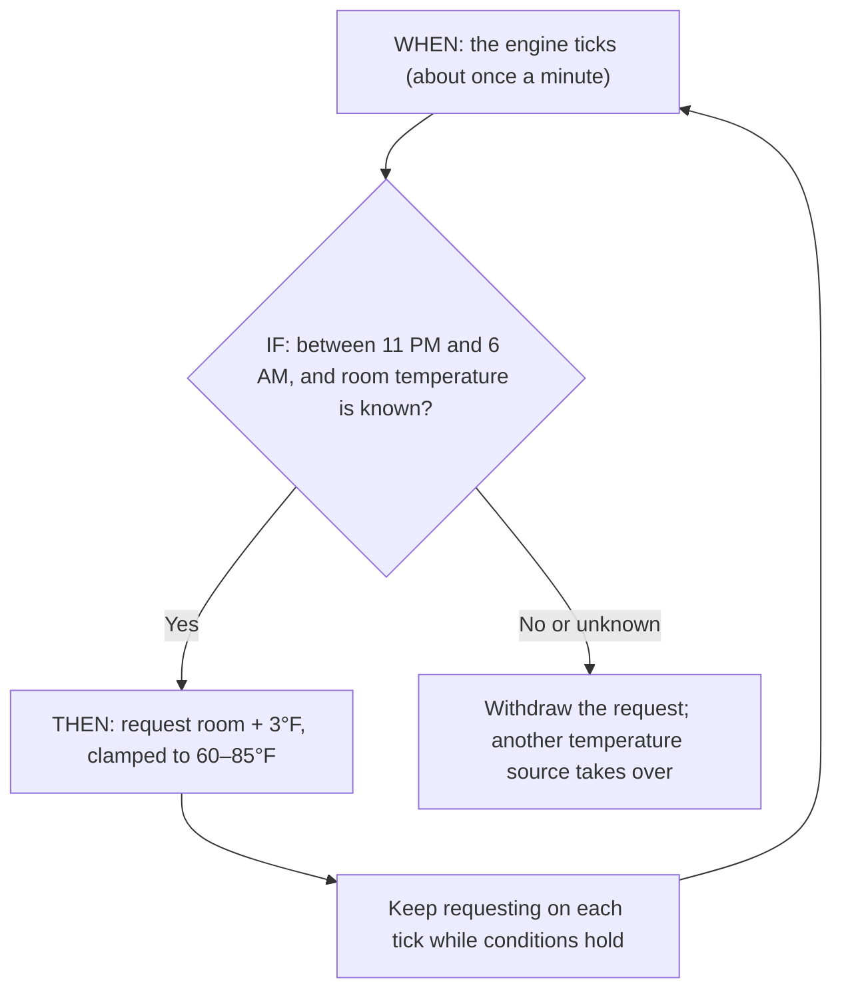
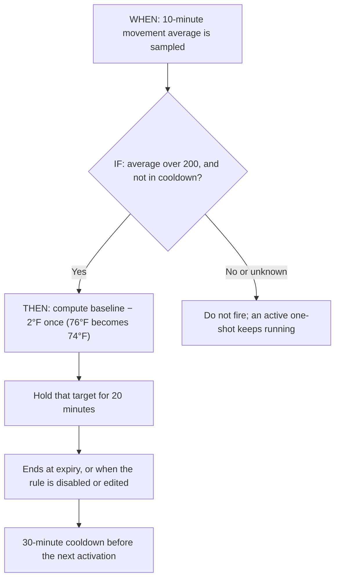

# Autopilot engine

This page explains how Autopilot works underneath. To create and manage rules, see [Autopilot](/core/autopilot/).

## Evaluation

The engine checks rules on a tick of roughly one minute. A change trigger is not an instant hardware interrupt, and a trigger only starts a check; it is not proof an action happened.

A rule is **WHEN / IF / THEN**: a trigger, a condition tree, and one or more actions. Conditions combine time windows, live signals, and history over a window. ALL requires every check to pass and ANY needs at least one. A missing reading is **unknown**, not zero or “all clear”, and it stays unknown when inverted with NOT. Missing signals are never evidence that a condition is true.

### Which signals are live

In Core v3.0 the engine reads these signals live:

- Each side's current temperature, target temperature, and current level.
- Water low.

Room, body (movement, heart rate, HRV, breathing), and bed-pressure signals are recorded and can be **backtested**, but have no live source yet, so a rule that depends on them cannot change the bed. This includes signals used only inside a THEN expression such as `ambient + 3`. Templates are tagged **live** or **backtest only** accordingly, and the rule list warns **no live … signal** for triggers and conditions that use them.

## Continuous policies and one-shots

### Follow the room overnight

The **Hold room +3°F** template means: between **11 PM and 6 AM**, request a bed target **3°F above room temperature**, limited to the template's **60–85°F** range. These are example template values, not recommended temperatures for everyone.

This is a **continuous policy**: it keeps asking for a target while its conditions remain true. Leaving the time window or losing a required condition withdraws the policy. Another available temperature source can then take over.

### Make a temporary adjustment

The **Cool when restless** template checks whether average movement over **10 minutes** exceeds **200**, then requests a target **2°F below the schedule/session baseline** for **20 minutes**. Its **30-minute cooldown** spaces out new activations. The movement threshold is an example signal value, not a clinical definition of restlessness.

This is a **one-shot**: the target is calculated once. If the baseline is 76°F, the request is 74°F, subject to its configured limits. Repeated checks do not turn it into 72°F, then 70°F. Conditions becoming false do not cancel an already-active one-shot; its expiry, or disabling/editing the rule, ends it.

| Setting            | What it controls                                                                                           |
| ------------------ | ---------------------------------------------------------------------------------------------------------- |
| Temperature limits | The lowest and highest target the action may request.                                                      |
| Hold / revert time | How long a one-shot request remains eligible to control the side.                                          |
| Cooldown           | How long the rule waits before another activation; it is not the hold timer.                               |
| Priority           | Which Autopilot request wins when several are active. Manual holds and run-once sessions still come first. |

“Revert” means choose whichever source applies **now**. It does not restore an old temperature or replay missed schedule points.

## Who controls the temperature

Several sources can ask for a temperature at once. From highest to lowest priority:

1. Manual hold, from the Temp screen, a cover tap, the iOS app, or the Dial.
2. Run-once session.
3. Autopilot request.
4. Recurring schedule.

Power-off and pump safety are separate: a temperature request never turns an off side on, and a pump-stall stop overrides everything. Explicitly turning a side off ends its manual hold; alarm vibration can still fire during a hold.

Manual holds and run-once sessions outrank Autopilot. Among Autopilot requests, higher rule priority wins, then the newest activation. Rules have a priority value, but the v3.0 editor does not expose it, so rules created in the app share the default priority and the newest activation wins. Recurring schedules supply the fallback.

A continuous policy owns a target while its conditions remain valid. False or unknown conditions withdraw it, and its lease expires if the engine stops refreshing it. A one-shot resolves its target once and holds it for 30 minutes by default; repeated engine ticks do not keep adding its delta or extending its lifetime.

Relative temperature actions use the schedule/session baseline, rather than their own previous output. Conditions still inspect live observations. This prevents a “lower by two degrees” expression from repeatedly lowering itself every tick.

## How backtests replay

The chart has two modes, matching the two kinds of rule:

| Mode           | When it applies                                                                            | What you see                                                                                                                                                                                                                                                  |
| -------------- | ------------------------------------------------------------------------------------------ | ------------------------------------------------------------------------------------------------------------------------------------------------------------------------------------------------------------------------------------------------------------- |
| **Edge**       | A threshold or windowed aggregate crossing fires a one-shot, such as _Cool when restless_. | The raw signal, its windowed average, the threshold, a red dot at each point the rule **would fire**, a tick where a fire was **suppressed** by cooldown, and the setpoint as a step line. The stats show would-fire count, suppressed count, and net effect. |
| **Continuous** | The setpoint tracks a live signal inside a time window, such as _Hold room +3°F_.          | The tracked signal and the resulting setpoint on one temperature scale, the pre-clamp setpoint as a dashed ghost line, and the clamp band. The stats show clamp hits and the setpoint range.                                                                  |

A few things the replay makes explicit:

- **Cooldown is not the hold timer.** Each suppression is a tick where the conditions held but the 30-minute cooldown had not elapsed.
- **Edge-mode setpoints are relative to a nominal baseline.** Per-side target history is not stored, so the step line shows the action's delta applied to the midpoint of the safety clamp, not the exact temperature the bed was at.
- **The threshold range helps you aim.** Under the trigger, the editor prints the compared value's recorded range over the last five nights, so you do not set a threshold the signal never reaches.
- **The list shows a five-night summary** for every saved rule: how many times it would have fired, and for threshold rules the peak value against the threshold. Templates are marked **live** or **backtest only** depending on whether their signals are wired on your Pod.

Backtests replay the full recorded series, including signals that are not yet available live. A rule that looks good in a backtest can still be unable to fire on the bed; check [Diagnostics](/core/autopilot/#diagnostics).

---

**Source reference:** [Autopilot design](https://github.com/sleepypod/core/blob/4cc76838/docs/adr/0023-autopilot-reactive-automations.md) · [Ownership and request lifetimes](https://github.com/sleepypod/core/blob/4cc76838/docs/temperature-control.md) · [Live signals and templates](https://github.com/sleepypod/core/blob/4cc76838/src/components/Autopilot/builderModel.ts) · [Engine wiring](https://github.com/sleepypod/core/blob/4cc76838/src/automation/instance.ts)
