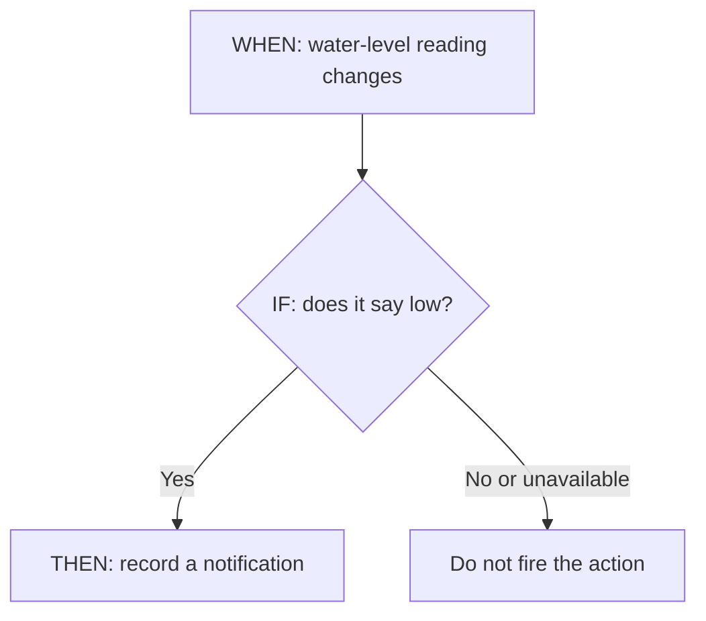
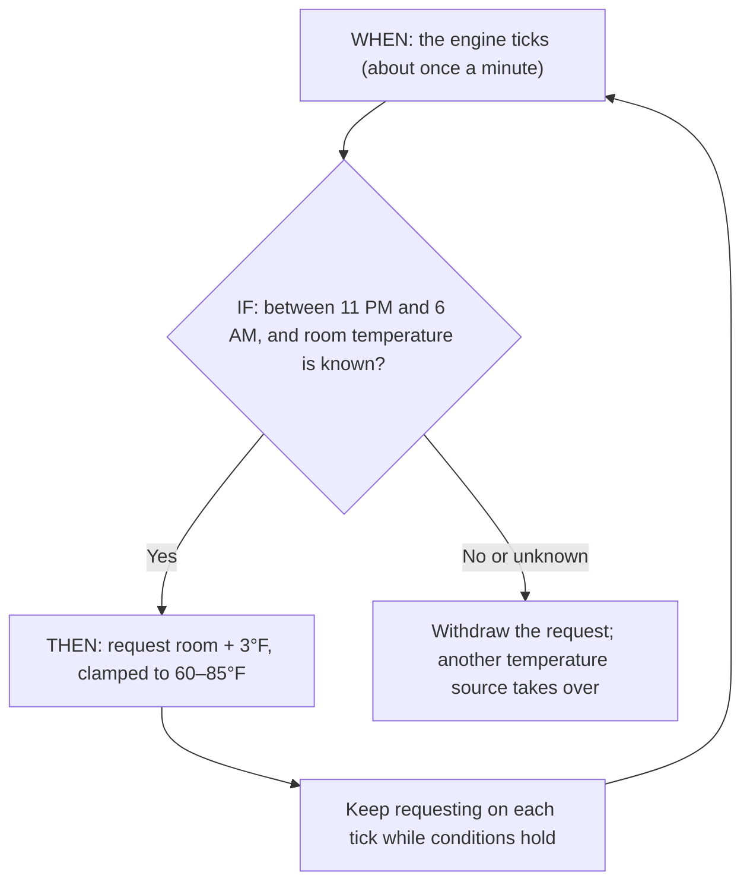
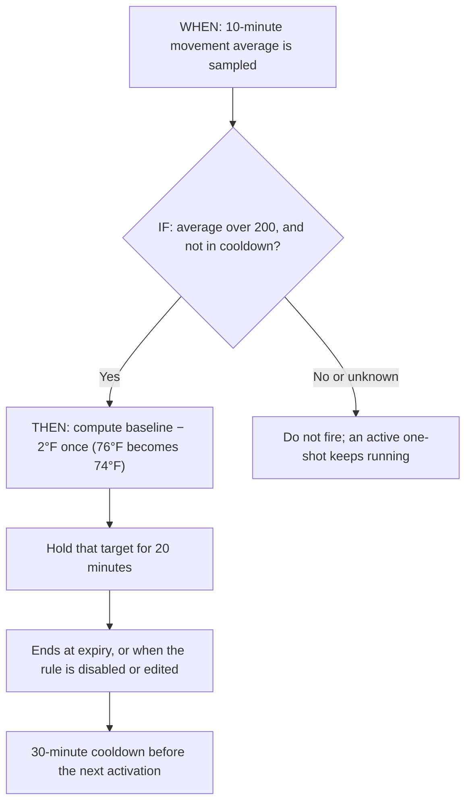
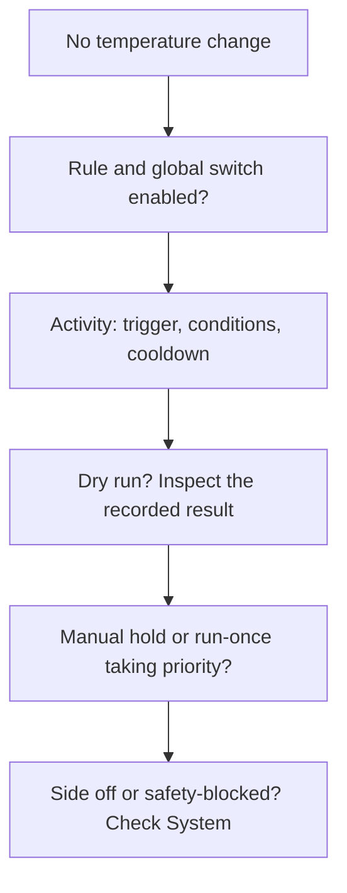

# Autopilot automations

Autopilot reacts to signals and conditions on the Pod. A recurring schedule answers “at what time?”; an automation also answers “under which conditions?” Both keep running when the browser closes.

## Read a rule as a sentence

Think of a rule as: **“When something happens, if these checks pass, then do this.”** Choose the bed side as well: an action for Left should not change Right.

| Part     | Plain-language meaning      | Example                                     |
| -------- | --------------------------- | ------------------------------------------- |
| **WHEN** | When should the rule check? | The water-level reading changes.            |
| **IF**   | What must be true?          | The new reading says the tank is low.       |
| **THEN** | What should happen?         | Record a notification that the tank is low. |

The **Tell me when water is low** template follows this pattern. A refill also changes the reading, but the IF check prevents a low-water notification when the tank is OK. In the referenced implementation, **Notify writes to the core service log**, with the action visible in rule activity; it does not send a phone push notification or email.

The engine checks on a roughly one-minute tick; a change trigger is not an instant hardware interrupt. A trigger starts a check; it is not proof that an action happened. A missing reading is **unknown**, not zero or “all clear.” The engine can combine conditions using ALL, ANY, and NOT. ALL requires every check to pass; ANY needs at least one. An unknown value stays unknown when inverted with NOT.

## Two temperature examples

The templates are starting points. Check the actual signal availability in **Autopilot → Diagnostics** and try a dry run before relying on a rule. A signal appearing in the editor or a recorded-night backtest does not guarantee a fresh live reading.

### Follow the room overnight

The **Hold room +3°F** template means: between **11 PM and 6 AM**, request a bed target **3°F above room temperature**, limited to the template's **60–85°F** range. These are example template values, not recommended temperatures for everyone.

This is a **continuous policy**: it keeps asking for a target while its conditions remain true. Leaving the time window or losing a required condition withdraws the policy. Another available temperature source can then take over.

### Make a temporary adjustment

The **Cool when restless** template checks whether average movement over **10 minutes** exceeds **200**, then requests a target **2°F below the schedule/session baseline** for **20 minutes**. Its **30-minute cooldown** spaces out new activations. The movement threshold is an example signal value, not a clinical definition of restlessness.

This is a **one-shot**: the target is calculated once. If the baseline is 76°F, the request is 74°F, subject to its configured limits. Repeated checks do not turn it into 72°F, then 70°F. Conditions becoming false do not cancel an already-active one-shot; its expiry, or disabling/editing the rule, ends it.

| Setting            | What it controls                                                                                           |
| ------------------ | ---------------------------------------------------------------------------------------------------------- |
| Temperature limits | The lowest and highest target the action may request.                                                      |
| Hold / revert time | How long a one-shot request remains eligible to control the side.                                          |
| Cooldown           | How long the rule waits before another activation; it is not the hold timer.                               |
| Priority           | Which Autopilot request wins when several are active. Manual holds and run-once sessions still come first. |

“Revert” means choose whichever source applies **now**. It does not restore an old temperature or replay missed schedule points.

## Build and inspect a rule

1. Open **Autopilot → Automations** and create a rule or start from a template.
2. Choose its side, trigger, conditions, and actions. Check temperature bounds, priority, and cooldown.
3. Start with a notification or dry run to inspect what the rule would do.
4. Review the rule's run history and any backtest against a recorded night before enabling hardware actions.
5. Use **Autopilot → Diagnostics** to inspect engine state and signals when results differ from expectations.

The rule model is **WHEN / IF / THEN**: a trigger, a condition tree, and one or more actions. Conditions can combine time windows, live signals, and historical aggregates. Missing signals are not evidence that a condition is true.

<BrowserFrame
  src="/media/core-autopilot.png"
  alt="Autopilot templates, temperature ownership timeline, and activity"
  caption="Real core UI in an isolated instance with synthetic example data."
/>

## Understand temperature behavior

Manual holds and run-once sessions outrank Autopilot. Among Autopilot requests, higher rule priority wins, then the newest activation. Recurring schedules supply the fallback.

A continuous policy owns a target while its conditions remain valid. False or unknown conditions withdraw it, and its lease expires if the engine stops refreshing it. A one-shot resolves its target once and holds it for 30 minutes by default; repeated engine ticks do not keep adding its delta or extending its lifetime.

Relative temperature actions use the schedule/session baseline, rather than their own previous output. Conditions still inspect live observations. This prevents a “lower by two degrees” expression from repeatedly lowering itself every tick.

## Why did nothing change?

Read the activity reason before changing the rule. **Outside its window**, **signal unavailable**, **cooling down**, and **another source owns the side** explain different situations. A temperature request alone does not turn an off side back on. Turning power on is a separate action.

## Stop or troubleshoot a rule

Disable the rule or use the global kill-switch to revoke its temperature requests. Editing or deleting a rule also revokes its old requests. Check the run log for fired, skipped, clamped, dry-run, and error outcomes. If another owner wins, inspect the [manual hold and Resume controls](/core/temperature/#manual-holds-and-resume).

Temperature clamping, cooldowns, action-rate limits, and pump protection still apply. A successful rule evaluation does not prove the hardware is circulating water; inspect **System → Thermal** for delivery evidence.

---

**Source reference:** [Rule templates and builder](https://github.com/sleepypod/core/blob/a1ecf7ea02826c8381b686a3ac7f30024dd24633/src/components/Autopilot/builderModel.ts) · [Engine and notification wiring](https://github.com/sleepypod/core/blob/a1ecf7ea02826c8381b686a3ac7f30024dd24633/src/automation/instance.ts) · [Autopilot design](https://github.com/sleepypod/core/blob/17d5369e/docs/adr/0023-autopilot-reactive-automations.md) · [Current ownership and request lifetimes](https://github.com/sleepypod/core/blob/17d5369e/docs/temperature-control.md) · [Autopilot interface](https://github.com/sleepypod/core/tree/17d5369e/src/components/Autopilot)
