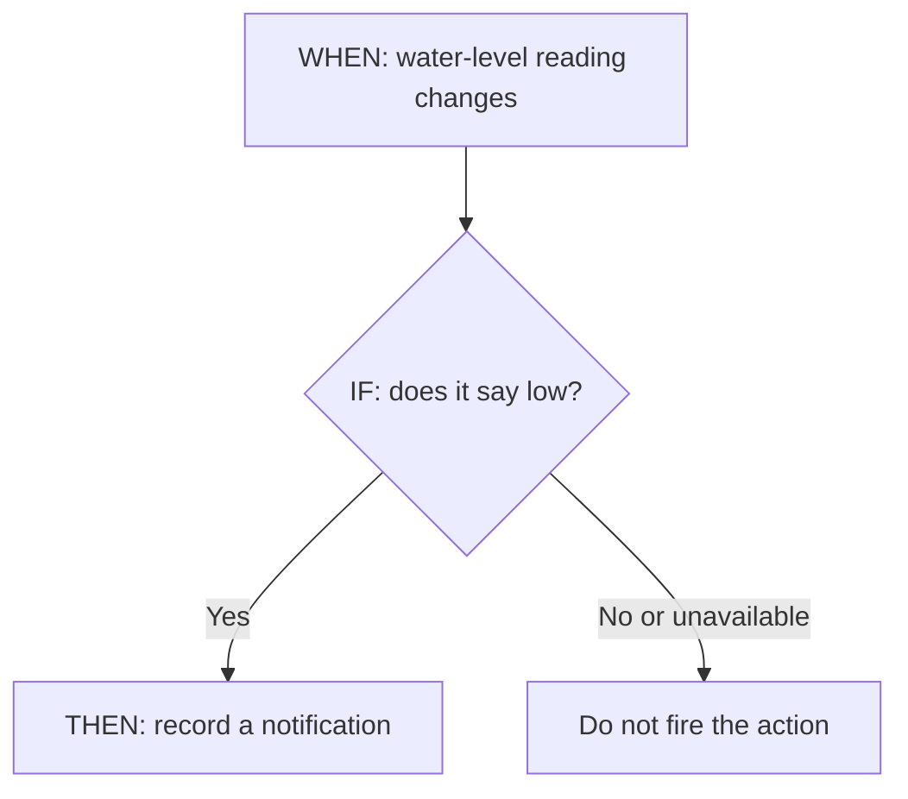
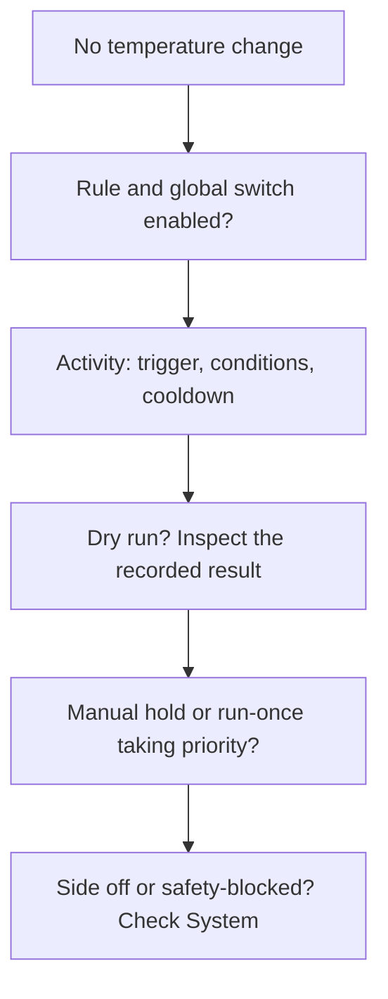

import { Callout } from 'nextra/components'

# Autopilot

A schedule answers “at what time?”. An Autopilot rule also answers “under which conditions?”. Rules run on the Pod, so they keep working when the browser is closed.

## Read a rule as a sentence

Every rule reads: **“When something happens, if these checks pass, then do this.”**

| Part     | Plain-language meaning      | Example                                     |
| -------- | --------------------------- | ------------------------------------------- |
| **WHEN** | When should the rule check? | The water-level reading changes.            |
| **IF**   | What must be true?          | The new reading says the tank is low.       |
| **THEN** | What should happen?         | Record a notification that the tank is low. |

A missing reading counts as **unknown**, never as zero or “all clear”, so a rule does not fire on missing data.

<Callout type="info">
  In Core v3.0, rules can only act on the bed using **bed temperature**, **bed level**, and **water
  low**. Rules that use room, body (movement, heart rate, HRV, breathing), or bed-pressure signals
  work in **backtests only** for now. Templates are tagged **live** or **backtest only**. See [which
  signals are live](/core/autopilot-engine/#which-signals-are-live).
</Callout>

## Automations

**Autopilot → Automations** is where you manage rules.

<BrowserFrame
  src="/media/core-autopilot.png"
  alt="Automations page with the Autopilot switch, who controls the bed tonight for each side, four rules with Off, Dry-run, and Active modes and backtest summaries, and the activity list"
  caption="Autopilot → Automations. Real core UI with synthetic example rules."
/>

- **Autopilot on / off** at the top is the master switch. When it is off, no rule is evaluated and a banner says so.
- **Who controls the bed tonight** shows, for each side, who is in control now (Manual hold, Run once, Autopilot, Schedule, or Off) and what happens next. The timeline has a **SCHED** lane for the schedule and an **AUTO** lane for each rule's window: green when active, hatched amber in dry run.
- **The rule list** shows each rule as a sentence, the side (**L**, **R**, or **L+R**), and a 5-night backtest summary. Set each rule's mode with **Off**, **Dry-run**, or **Active**. Select a rule to edit it.
- **Activity** explains why the bed changed, or didn't, night by night. Filter by **All**, **Fired**, **Would fire**, or **Skipped**. Reasons include **outside window**, **condition not met**, **cooling down**, **manual hold**, **side is off**, **another source owns the side**, and **unavailable**. **Show more** loads earlier nights.

With no rules yet, the page offers three templates:

| Template                      | What it does                                                                                     | Runs          |
| ----------------------------- | ------------------------------------------------------------------------------------------------ | ------------- |
| **Hold room +3°F**            | Between 11 PM and 6 AM, keep the bed 3°F above room temperature, within 60–85°F                  | Backtest only |
| **Cool when restless**        | If movement stays above 200 for 10 minutes, lower the bed 2°F for 20 minutes; 30-minute cooldown | Backtest only |
| **Tell me when water is low** | When the water reading changes to low, write a notification                                      | Live          |

The template values are examples, not recommendations. **Notify** writes to the Core service log and the rule's activity; it does not send a phone notification or email.

## Build a rule

Select **New automation**, a template, or an existing rule. Nothing is saved until you select **Save**.

1. Name the rule by editing the title.
2. Choose the **Side**: **L**, **R**, or **Both**, and the **Mode**: **Dry-run** (default) or **Active**. In dry run, Autopilot records what it would do but never touches the bed.
3. **When** chooses what starts a check:
   - **Aggregate**: average, max, min, sum, or count of a signal over the last N minutes, compared with a value.
   - **Threshold**: a signal compared with a value.
   - **On change**: whenever a signal changes.
   - **Time of day**: between two whole hours.

   For Aggregate and Threshold, the editor shows the signal's range over the last 5 nights so you can pick a threshold it actually reaches.

4. **If** adds optional extra checks. All must pass. Add a **Time window** or a **Condition**.
5. **Then** chooses the action:
   - **Set temperature** **By amount** (raise or lower by N°F, optionally reverting after N minutes) or by **Expression**, such as `ambient + 3`, using `ambient`, `target`, and `current`.
   - **Safety clamp**: the lowest and highest temperature the rule may ask for.
   - **Set power**: On or Off.
   - **Notify**: a message.
   - **Cooldown**: minutes to wait before the rule can fire again (30 by default).
6. Check **Reads as**, the sentence version of your rule, and the backtest, then **Save**.

Signals you can use:

| Group        | Signals                                                                                                             |
| ------------ | ------------------------------------------------------------------------------------------------------------------- |
| **Room**     | Ambient temp, Ambient humidity, Ambient light                                                                       |
| **Bed**      | Current temp (level), Target temp (level), Bed surface temp, Surface temp spread, Surface temp gradient, Water temp |
| **Body**     | Movement, Heart rate, HRV, Breathing rate                                                                           |
| **Presence** | Bed pressure (peak), Bed pressure (avg), Pressure spread                                                            |
| **System**   | Water low                                                                                                           |

Rules using bed-pressure signals also show a **Bed pressure** panel with head, torso, and legs zones, live or replayed.

## Backtest before you trust it

Every rule is replayed against **recorded history** while you edit it. Pick one of the last five recorded nights and the backtest shows what the rule would have done. Nothing in the panel changes your Pod.

<BrowserFrame
  src="/media/core-autopilot-backtest.png"
  alt="The Cool when restless rule editor with its backtest chart: the movement trace, the 200 threshold, fire markers, cooldown bands, and the resulting setpoint"
  caption="The rule editor replaying “Cool when restless” over a synthetic night, using Core's own replay engine."
/>

- **Edge** backtests (threshold rules) show the signal, the threshold, a red dot where the rule **would fire**, and a tick where cooldown **suppressed** it. The stats count both.
- **Continuous** backtests (rules that track a signal) show the signal, the resulting setpoint, and where the safety clamp limited it.

If a side has no recorded nights yet, the panel says so. A good backtest does not mean the rule can fire live; see the note above about live signals. For how replays work, see [how backtests replay](/core/autopilot-engine/#how-backtests-replay).

## Diagnostics

**Autopilot → Diagnostics** shows what each rule has actually been doing.

<BrowserFrame
  src="/media/core-autopilot-diagnostics.png"
  alt="Autopilot Diagnostics with the running switch, a Hold room rule card showing last evaluated, condition, fires today, the 3-hour evaluation strip, and the run log"
  caption="Autopilot → Diagnostics. Synthetic example evaluations."
/>

- **Autopilot running** or **Autopilot halted**: the master switch. While halted, no rule commands hardware.
- One card per rule, with its **Mode** (**Off**, **Dry-run**, **Live**) and:
  - **Last evaluated**, the **Condition** with its live value, **Would have fired today**, and **Fired today** (with how many commands were actually sent).
  - **Evaluations**: one tick per minute for the last 3 hours, coloured skipped, would fire, fired, cooldown, or no evaluation logged.
  - **Run log**: today's results with repeats grouped. Filter by **Would fire**, **Fired**, **Skipped**, or **Missing**.

## Why did nothing change?

Read the activity reason before changing the rule. **Outside its window**, **signal unavailable**, **cooling down**, and **another source owns the side** explain different situations. A temperature request alone does not turn an off side back on. Turning power on is a separate action.

## Stop a rule

Set the rule to **Off**, or turn off the master switch to stop every rule at once. Turning a rule off, editing it, or deleting it withdraws its temperature requests. If another source wins, check the [manual hold and Resume controls](/core/temperature/#manual-holds-and-resume).

Safety clamps, cooldowns, and pump protection still apply to every rule. A rule firing does not prove the water is circulating; check [System → Thermal](/core/system/thermal/).

For how rules evaluate and who controls the temperature, see the [Autopilot engine](/core/autopilot-engine/).

---

**Source reference:** [Autopilot interface](https://github.com/sleepypod/core/tree/4cc76838/src/components/Autopilot) · [Rule builder and templates](https://github.com/sleepypod/core/blob/4cc76838/src/components/Autopilot/builderModel.ts) · [Notification wiring](https://github.com/sleepypod/core/blob/4cc76838/src/automation/instance.ts) · [Autopilot design](https://github.com/sleepypod/core/blob/4cc76838/docs/adr/0023-autopilot-reactive-automations.md)
