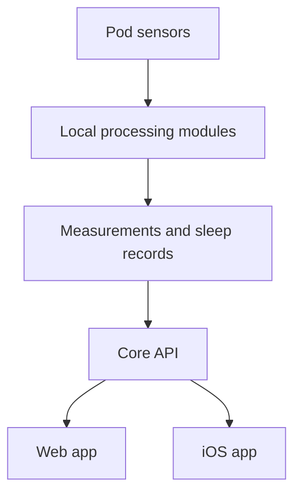

# Follow your data

A sensor reading takes a few steps before it becomes something you can explore. This is the simplified path for biometrics: sensing, local processing, storage, then the app.

## See the real system at work

<Demo
  wide
  autoplay
  src="/media/core-health-flow.mp4"
  poster="/media/core-health-map.png"
  title="From sensors to outputs"
>
  A silent recording of the real System → Health map with synthetic data. Moving dots trace active
  connections through hardware, services, and core to the outputs. It plays and loops on its own.
</Demo>

The map shows where data is flowing now. The history beneath it helps explain when a stage stopped producing output—even if its service was still running.

## 1. The Pod senses

Piezo signals support heart-rate and breathing estimates. Capacitive sensors help detect presence and movement. Other records describe the bed and its environment. Which readings are available depends on the hardware, firmware, and active modules.

Firmware delivers these readings as RAW files or local NATS messages. Each consumer selects one source. You do not need to manage this transport to read your nights, but it matters when diagnosing missing data.

## 2. Local modules make sense of the signals

Independent processing modules extract vitals, presence, movement, and environmental measurements. Calibration provides context; signal quality still matters. Results go into `biometrics.db` on the Pod. Device settings and schedules live separately in `sleepypod.db`.

A missing measurement stays missing. It should not appear as a heart rate of zero or proof that nobody was in bed.

## 3. The app gives you a view

The core API reads the stored results for the web and iOS apps. iOS also performs its own on-device sleep analysis. Open **Sleep → Nights** for records or **Sleep → Biometrics** for measurements.

<BrowserFrame
  src="/media/core-sleep.png"
  alt="Core Nights view with an example sleep record"
  caption="Real app capture with synthetic sleep stages, heart rate, and night records."
/>

A night record is not a guarantee of complete biometrics: power transitions can create records even when sensor modules are not running. [Learn what each measurement means](/core/biometrics/).

## Where does Autopilot fit?

Autopilot evaluates available live signals and historical aggregates against your rules. A rule can request a temperature change, but the temperature controller decides which request owns each side. Manual holds and run-once sessions take priority. [Walk through WHEN, IF, and THEN](/core/autopilot/).

## Follow a gap upstream

If the app has no measurements, open **System → Pipeline**, **Sensors**, and **Health**. Check incoming timestamps, module health, and output rows in that order. On NATS firmware, an empty RAW archive is expected. The [troubleshooting checklist](/troubleshooting/core/#biometrics-are-empty) walks through the checks.

For implementation details, see the [system architecture](/developers/architecture/) and [sensor pipeline](/developers/sensor-pipeline/).

---

**Source reference:** [Sensor transports](https://github.com/sleepypod/core/blob/17d5369e/docs/nats-frame-readers.md) · [Processing modules](https://github.com/sleepypod/core/blob/17d5369e/docs/adr/0012-biometrics-module-system.md) · [Temperature ownership](https://github.com/sleepypod/core/blob/17d5369e/docs/temperature-control.md) · [iOS analysis](https://github.com/sleepypod/ios/blob/845b3de9d0fb3bc9c1a4815c14edde5648986995/README.md)
