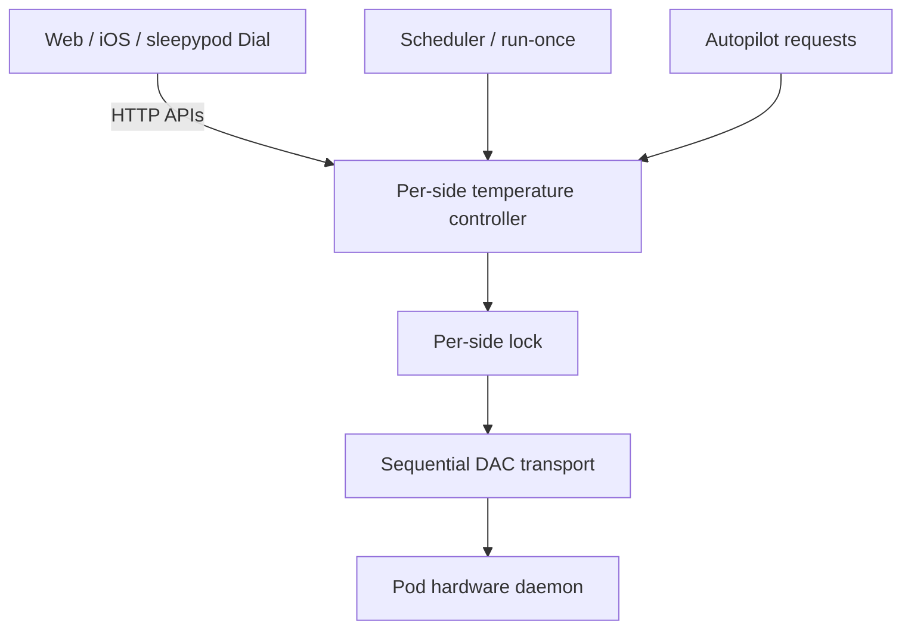
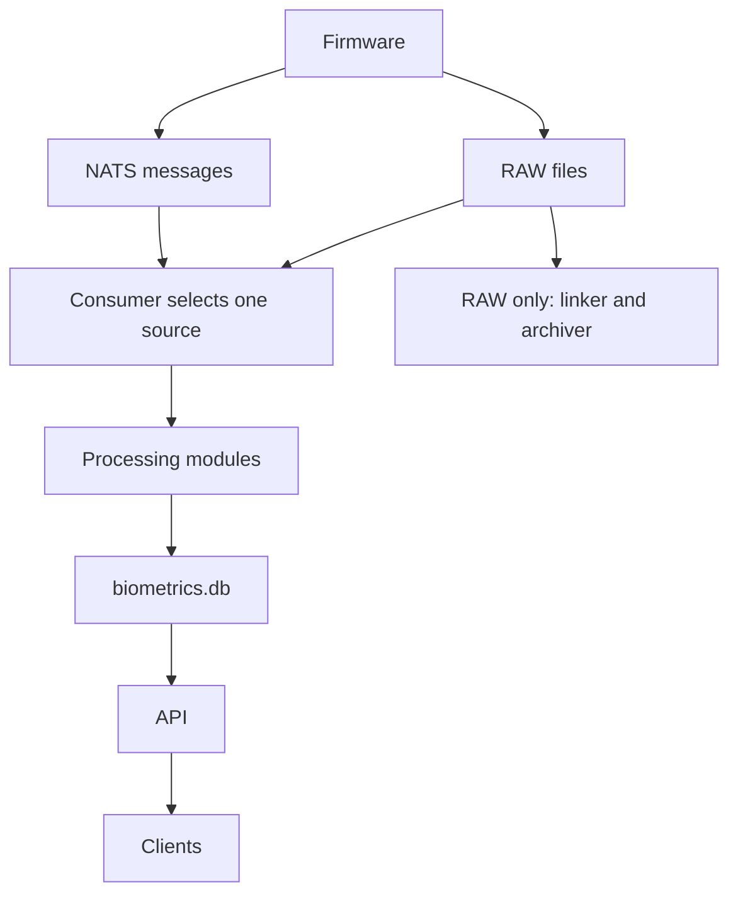

# System architecture

## Control plane

Hardware writes use per-side locking. The DAC protocol has no correlation IDs, so commands are strictly sequential and each response belongs to the command just sent. Shared singletons live on `globalThis` to survive multiple module instances under Turbopack.

## Read path

The DAC monitor polls hardware, updates state, and broadcasts changes. WebSocket delivery on port 3001 provides live sensor and device frames. Clients can fall back to API reads; the web UI prefers WebSocket status through `useDeviceStatus`.

## Biometrics pipeline

On RAW deployments, the hot RAW directory is a RAM-backed filesystem. A linker pins frames before firmware deletion, and an archiver compresses them onto persistent storage. Python modules are independent systemd processes and communicate through a database schema contract.

NATS deployments use live sensor subscriptions instead; no RAW archive is required. The selector never runs both sources concurrently in one consumer. See [transport selection and calibration](/developers/sensor-pipeline/) for restart behavior and readiness.

## Two databases

| Database        | Responsibility                                                       |
| --------------- | -------------------------------------------------------------------- |
| `sleepypod.db`  | Device settings/state, schedules, tap gestures, and system health    |
| `biometrics.db` | Vitals, sleep records, movement, calibration, and sensor time series |

Each database has its own Drizzle schema and migration set. Biometrics uses WAL and a busy timeout to accommodate multiple writers. Generate migrations with the repository tools; do not hand-edit migration journals.

## Network boundaries

The HTTP API is LAN-only and unauthenticated. MQTT is an outbound client connection to a broker you run. HomeKit is an opt-in local bridge. Read the installed API contract before integrating a new client.

---

**Source reference:** [Current source selection](https://github.com/sleepypod/core/blob/17d5369e/docs/nats-frame-readers.md) · [Temperature arbitration](https://github.com/sleepypod/core/blob/17d5369e/docs/temperature-control.md) · [Architecture invariants](https://github.com/sleepypod/core/blob/ae930282a0f3dcea4edbe3b3bc0b095c572d3b3d/AGENTS.md) · [System and storage diagrams](https://github.com/sleepypod/core/blob/ae930282a0f3dcea4edbe3b3bc0b095c572d3b3d/README.md) · [RAW frame retention](https://github.com/sleepypod/core/blob/ae930282a0f3dcea4edbe3b3bc0b095c572d3b3d/docs/adr/0018-tmpfs-raw-frames.md)
