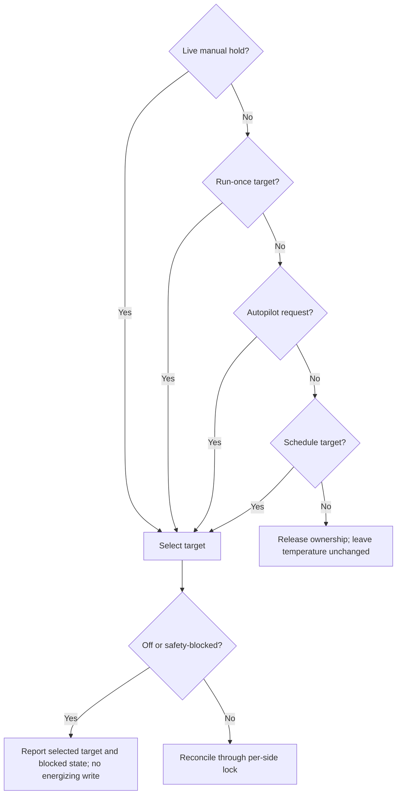

# Temperature controller contract

Every ordinary writer—web, REST, HomeKit, gestures, schedules, run-once sessions, and Autopilot—uses a shared per-side controller. It resolves ownership before serializing writes through `withSideLock`. Keep the controller singleton on `globalThis` so server bundles share one authority.

## Set and release a manual hold

A REST temperature adjustment creates a 30-minute hold by default:

```http
POST /api/device/temperature
Content-Type: application/json

{"side":"left","temperature":75,"holdMinutes":60}
```

`temperature` is Fahrenheit. Optional `holdMinutes` accepts 1–1440 minutes. Each accepted user adjustment renews the timer, so a polling client must not resend its target.

```http
POST /api/device/temperature/resume
Content-Type: application/json

{"side":"left"}
```

Resume resolves the currently applicable request. It does not replay elapsed schedule points. The tRPC equivalents are `device.setTemperature`, `device.getTemperatureControl`, and `device.resumeTemperature`.

## Read ownership

`GET /api/device/temperature/control?side=left` returns a control object. Device-status responses and WebSocket `deviceStatus` frames also carry it under `temperatureControl.left` and `.right`.

| Field               | Meaning                                                |
| ------------------- | ------------------------------------------------------ |
| `source`            | `manual`, `run-once`, `autopilot`, `schedule`, or null |
| `requestId`         | Identifier of the selected request                     |
| `targetTemperature` | Selected target in Fahrenheit, or null                 |
| `holdUntil`         | Expiry in Unix milliseconds, or null                   |
| `blocked`           | `safety`, `off`, or null                               |

The selected target may differ from the effective hardware target when blocked. It remains Fahrenheit even if surrounding status was requested in Celsius. Tolerate an absent control object on older versions or before startup completes.

## Resolve competing requests

For each side, choose the highest-priority **currently valid** request. Autopilot ties use rule priority, then newest activation, then a stable request ID. Selection and permission to write hardware are separate decisions.

<div className="docs-diagram">



</div>

Schedules and sessions keep their clocks while a higher-priority request wins. After Resume or expiry, reconcile the target that applies now. A temperature-only reconciliation must not repower an off side.

## Duration is a separate clock

The existing `duration` field is hardware heating duration in seconds, not a hold duration. An explicit duration creates a persisted absolute cutoff. Resume, hold expiry, restart, keepalive, and safety recovery cannot extend it. Duration zero shuts the side off without creating a hold.

Explicit shutdown ends the hold. Ordinary temperature reconciliation does not repower an off side. A power-on request without a temperature uses the current owner or 75°F without creating a hold; an explicit power-on temperature creates one.

## Writer invariants

- Priority is manual, run-once, Autopilot, then recurring schedule.
- Holds persist in SQLite with their original expiry; restart does not renew them.
- Resume or power commands supersede queued debounced adjustments, which return a conflict instead of undoing the newer command.
- Autopilot publishes a complete per-side request set per evaluation; policies use renewable leases, while one-shots have fixed lifetimes.
- Raw `/api/device/execute` is a diagnostic bypass, not a consumer-control API. It does not create or release holds, and reconciliation may replace its target.

---

**Source reference:** [Full controller contract](https://github.com/sleepypod/core/blob/17d5369e/docs/temperature-control.md) · [Controller implementation](https://github.com/sleepypod/core/tree/17d5369e/src/temperature)
